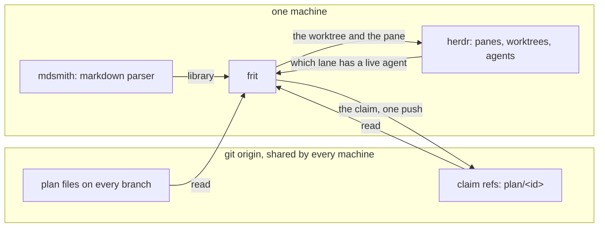
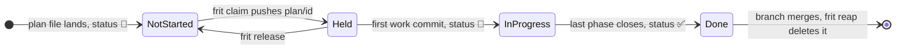

# frit

[![codecov][codecov-badge]][codecov-project]

frit is a command-line tool for developers who run coding agents. It
finds every plan across many git repositories, branches and machines
and tells you which plan is ready to start. It claims a plan with one
atomic git push, so two agents never begin the same work. Then it
hands the plan to an agent in its own worktree and steps back. The
name is a glassmaking term for material prepared before the melt;
[the naming note](docs/research/naming.md) explains the choice.

## The problem frit solves

Work on a developer's machine is scattered: many repositories, many
branches in each, worktrees for some, and agents running in a few. A
plan is a markdown file that may exist on only one branch. No single
view shows all of that, and nothing stops two agents from starting
the same plan. [Why frit exists](docs/research/fleet-index/README.md)
records the survey that found no tool for this gap.

frit is that single view. It does three things:

- It reads every plan file on every branch of every repository under
  one root directory, without checking anything out.
- It answers which plans are ready: their dependencies are done and
  nobody holds them.
- It claims a plan by pushing a branch to the git remote, then hands
  the plan to an agent in a worktree of its own. That claim is the
  only thing frit writes: it never edits a plan, never writes a prompt
  of its own, and never reads an agent's conversation. The
  [architecture](docs/architecture.md) page calls this the
  one-mutation rule.

## How frit works

Three tools share the job. mdsmith parses the markdown. herdr runs
the terminal panes and worktrees that agents work in. frit reads
both and joins them with what git holds. [How frit and mdsmith fit
together](docs/mdsmith-and-frit.md) draws the line between the three.



Everything the machines must agree on lives on the git remote. A ref
push is the one operation every machine can race on safely. A fact
that never reaches the remote, such as a running pane or an open pull
request, stays on the machine that has it. frit reads that fact from
herdr on that machine, or asks the agent. It never guesses it from
the refs. [CLAUDE.md](CLAUDE.md) states this rule and
[architecture.md](docs/architecture.md) explains it.

So every machine sees a claim once it fetches, while a running agent
is visible only where it runs. `--hosts a,b` reads other machines'
herdr over ssh; a host that does not answer shows `?` in the board's
agent column. When two machines claim one plan at once, the remote
accepts the first push and the second reports who won.

A plan moves through a small set of states. The status glyph lives in
the plan file's front matter. The hold is a branch on the remote.



[How claiming works](docs/claiming.md) has the rules for each edge,
including takeover of a stale lease and the rescue ref that parks
unmerged commits.

## Words frit uses

| Word        | Meaning                                                              | Defined in                                                |
| ----------- | -------------------------------------------------------------------- | --------------------------------------------------------- |
| fleet, root | every git repository under one directory, the root                   | [claiming.md](docs/claiming.md#the-fleet)                 |
| plan        | a markdown file with id, title, status and model in its front matter | [plan/proto.md](plan/proto.md)                            |
| hold, lease | the branch `plan/<id>` on the remote; its tip says who holds it      | [claiming.md](docs/claiming.md#the-work-ref-is-the-lease) |
| lane        | the worktree on a plan's branch, and the pane an agent works it in   | [claiming.md](docs/claiming.md#work-rides-the-same-ref)   |
| rescue ref  | where unmerged commits are parked before a lane is torn down         | [claiming.md](docs/claiming.md#fencing-and-yield)         |
| tier        | the model named in a plan's front matter: haiku, sonnet or opus      | [plan/proto.md](plan/proto.md)                            |

## Install

frit needs Go 1.25 or newer to build from source:

```sh
go install github.com/jeduden/frit/cmd/frit@latest
```

Or download a binary from the
[releases page](https://github.com/jeduden/frit/releases) and check
its build provenance attestation before you run it:

```sh
gh attestation verify frit-linux-amd64 -R jeduden/frit
```

`frit version` prints the tag a release was built from, and `dev` for
a source build. Three other tools matter:

- **git** must be on `PATH`. frit runs it as a subprocess for every
  read and for the claim, as [CLAUDE.md](CLAUDE.md) requires.
- **herdr** must be running for any verb that touches a lane: `claim`,
  `start`, `open`, `nudge`, `message` and `yield`. The survey verbs
  work without it; `who` and `board` then show the agent as unknown.
- **mdsmith** lints plans and regenerates the plan index. Install it
  with `go install github.com/jeduden/mdsmith/cmd/mdsmith@latest`.

## First run

Point frit at the directory that holds your repositories, then give
one repository the files frit and mdsmith read:

```sh
export FRIT_ROOT=~/git
cd ~/git/myrepo
frit init --mdsmith .   # writes .frit.yml, .mdsmith.yml, plan/proto.md, PLAN.md
```

Write a plan as `plan/<id>_<slug>.md`, following the template in
[plan/proto.md](plan/proto.md). The id is the creation minute in UTC,
from `date -u +%y%m%d%H%M`. Commit it and push. Then:

```sh
mdsmith check plan/    # the plan passes the schema
frit doctor            # no missing Goal, tier or Execution row
frit ready             # the plan is listed: deps done, nobody holds
frit claim <id>        # pushes plan/<id>, stands up a worktree beside the repo
frit board             # shows the hold and, once one runs, the agent
```

To claim and start an agent in one step, use `frit start <id> --go`
instead of `claim`. To take the best plan without naming one, use
`frit pick --go`. Both are dry runs until `--go`.

## Commands

`frit --help` lists every verb, and `frit <verb> --help` its flags.
Grouped by what they do:

| Group    | Verb                 | What it does                                                        |
| -------- | -------------------- | ------------------------------------------------------------------- |
| survey   | `repos`              | list repositories and their worktrees                               |
| survey   | `plans [--detail]`   | count plan files on every ref, or list them                         |
| survey   | `board [--wip]`      | outstanding plans: status, who holds each, the agent on it          |
| survey   | `who`                | which lane has a live agent, read from herdr                        |
| survey   | `stale --days N`     | worktrees whose branch has not moved                                |
| survey   | `orphans`            | claims, checkouts and rescue refs that no longer add up             |
| survey   | `doctor`             | plans with a semantic gap: missing Goal, tier, Execution row        |
| survey   | `drift`              | not-done plans whose work has landed, with the commit evidence      |
| discover | `ready`              | plans startable now: deps done, nobody holds                        |
| discover | `pick [-n N]`        | the same, ranked by how many plans each unblocks; `--go` starts one |
| discover | `next <plan>`        | the first phase of a plan not yet done                              |
| discover | `phase <plan>`       | the open phase's spec, prior handoff, notes, tier and gate          |
| discover | `show <plan>`        | a plan and everything that blocks it                                |
| discover | `find <text>`        | search titles and summaries across every ref                        |
| lease    | `claim <plan>`       | mint the atomic hold on a startable plan                            |
| lease    | `release <plan>`     | end this lane's own lease with a release marker                     |
| lease    | `yield <plan>`       | end a fenced lane: park its commits to a rescue ref, tear it down   |
| drive    | `open <plan>`        | focus the pane a plan's lane runs in; sends no text                 |
| drive    | `nudge <plan>`       | prompt the next open phase into an idle lane                        |
| drive    | `message <plan> ...` | send text to a live lane, working or idle                           |
| drive    | `start <plan>`       | claim, stand up the worktree, start the agent, send the prompt      |
| clean    | `reap [<plan>]`      | tear down what `orphans` reports                                    |
| setup    | `init [<dir>]`       | write `.frit.yml` with every default; `--mdsmith` adds the schema   |
| setup    | `skills [<dir>]`     | install the bundled agent skills into `.claude/skills`              |

Three conventions hold across the table:

- **A `<plan>` is named three ways.** An exact id, a fragment of its
  title or branch, or nothing when you stand inside its worktree, as
  [UX principles](docs/ux-principles.md#naming-a-plan) describe.
- **Verbs that act are dry runs until `--go`.** `nudge`, `message`,
  `start`, `reap` and `pick` print what they would do and stop. `claim`,
  `release` and `yield` act at once, since the push is the whole verb.
- **A refusal is not an error.** When frit will not claim a plan it
  prints the reason and exits 0. Every reason is listed in
  [the refusal table](docs/claiming.md#when-a-claim-is-refused).

## Scripting with JSON

Every verb takes `--json` and answers with a document instead of a
table. Both come from the same model, so they never disagree.

```sh
frit orphans --json | jq '.repos[] | select(.unstaffed | length > 0)'
```

Three rules make the document safe to write against. Every key is
always present. A list is `[]` and never null. A repository frit could
not read is carried in `problems`, so stdout is the whole report. The
golden files in [internal/report/testdata](internal/report/testdata)
pin every verb's document, and
[UX principles](docs/ux-principles.md#the-json-contract) explain them.

## Configuration

Per-repository settings travel with the project in a committed
`.frit.yml`. `frit init` writes every key with its default and a
comment. A repository with no file gets the defaults.

```yaml
plan-dir: plan          # where plan files live
holds:                  # ref names that count as a claim; {id} is the plan id
  - "plan/{id}"
  - "plan/{id}-*"
remote: origin          # where the lease is pushed
takeover-window: 2h     # how long a lease sits unchanged before it reads stale
sample-gap: 30m         # a gap between looks wider than this restarts the window
# base: origin/main     # pin the ref a lease is dated against
```

frit's own settings, such as `--root`, resolve most specific first;
[CLAUDE.md](CLAUDE.md#configuration) pins the order with a test.

1. the command line, `--root`
2. the environment, `FRIT_ROOT`
3. `.frit.yml` beside the work, or the file `$FRIT_CONFIG` names
4. the user config, `$XDG_CONFIG_HOME/frit/config.yml`

## Working with agents

frit ships the instructions an agent needs to drive it. `frit skills`
writes seven Claude Code skills into a repository's `.claude/skills`:

| Skill          | What the agent does with it                                                |
| -------------- | -------------------------------------------------------------------------- |
| `plan-pick`    | find the next unheld plan, claim it, start its lane                        |
| `plan-phase`   | execute one phase of a plan, test first, and close it                      |
| `plan-handoff` | close a phase: write the handoff, flip its status                          |
| `plan-new`     | write a plan that passes the schema on the first try                       |
| `plan-sync`    | reconcile plan statuses against what `drift` found                         |
| `plan-tidy`    | read `orphans` and `stale`, then act with `yield`, `release`, `reap`       |
| `plan-drive`   | survey the board and drive one lane up the `open`, `nudge`, `start` ladder |

The skills are embedded in the binary, and `--via "go run ./cmd/frit"`
changes how they invoke frit. The one prompt frit ever sends to a pane
is `/plan-phase <id> [phase]`, composed in
[internal/dispatch](internal/dispatch/dispatch.go).
[Development](docs/development.md#the-skills-bundle) has the rest.

## Releases

Every release is on the
[GitHub releases page](https://github.com/jeduden/frit/releases), or
from a terminal with `gh release list -R jeduden/frit`. A release
carries notes generated from the merged pull requests, five platform
binaries, a checksum file and a provenance attestation.

A release is made from the Actions "Run workflow" button on
[release.yml](.github/workflows/release.yml) with a version such as
`v0.11.0`. The workflow checks the version, runs the suite, builds the
binaries, and creates the tag only once they exist.
[Development](docs/development.md#ci-and-release) has the details.

## Documentation map

| Page                                                 | Answers                                                        |
| ---------------------------------------------------- | -------------------------------------------------------------- |
| [CLAUDE.md](CLAUDE.md)                               | the rules the code and its agents follow; the current record   |
| [PLAN.md](PLAN.md)                                   | what is planned, in progress and done                          |
| [docs/architecture.md](docs/architecture.md)         | what frit, mdsmith and herdr each own                          |
| [docs/claiming.md](docs/claiming.md)                 | how a lease is made, kept, taken over, yielded and scavenged   |
| [docs/reaping.md](docs/reaping.md)                   | the orphan categories and what `reap` may delete               |
| [docs/ux-principles.md](docs/ux-principles.md)       | why the verbs, flags and JSON behave as they do                |
| [docs/development.md](docs/development.md)           | build, test, lint, the scenario matrix, skills, CI and release |
| [docs/research](docs/research/fleet-index/README.md) | dated notes on how each decision was reached                   |

To contribute, follow [CLAUDE.md](CLAUDE.md): a failing test, the code
that passes it, one small commit, with `mdsmith check .` clean.

## License

[MIT](LICENSE)

[codecov-badge]: https://codecov.io/gh/jeduden/frit/graph/badge.svg
[codecov-project]: https://codecov.io/gh/jeduden/frit
