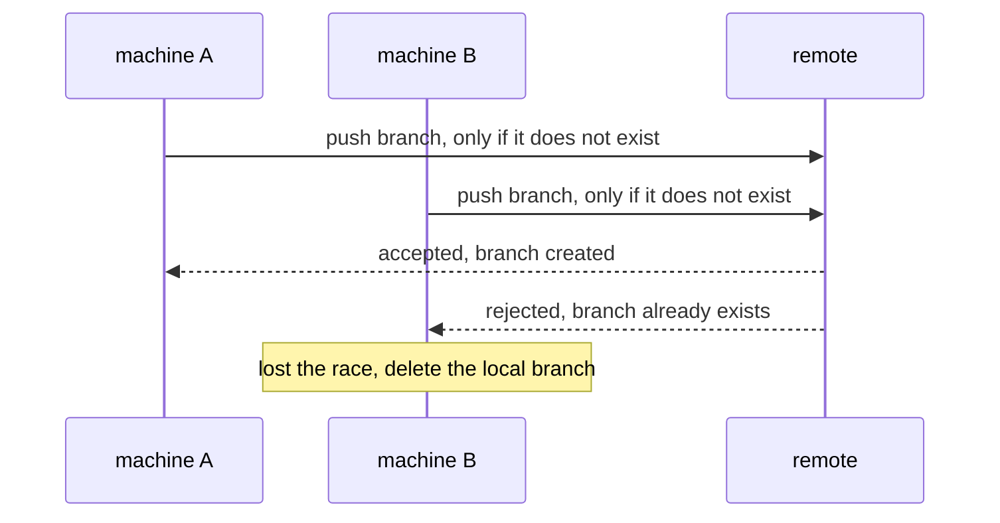

# How claiming works

frit reads many git repositories and shows the plans in them. It
changes only one thing: it claims a plan. A claim marks a plan as
being worked, recorded as a branch on the repository's shared remote,
so other machines see it once they fetch. This page explains how a
claim is made, how races resolve, how it can fail, and how to find
and drop a stale claim.

## The fleet

The fleet is every git repository under one directory, the root, set
with `--root` (or `FRIT_ROOT`, or a config file). Most commands read
the whole fleet; `frit init` writes to one repository you name, and
`frit version` reads nothing.

## A claim is a branch

A git ref is a name pointing at a commit; a branch is a ref. frit
claims a plan by creating a branch `plan/<id>-<slug>`: the id is the
plan's id, the slug is the plan file's name without `.md` and without
everything up to the first underscore. `plan/7_shader-unit.md` claims
on `plan/7-shader-unit`.

The branch points at an empty commit — the marker — that changes no
files. Its job is to exist, so other machines see the plan is taken.

frit finds claims by listing the branches and keeping the ones whose name
matches a hold pattern. Each repository sets its own patterns in
`.frit.yml`. frit drops any branch already merged into the repository's
default branch before it matches, so a finished plan stops showing as
claimed even though its branch still exists.

frit always mints the fixed shape `plan/<id>-<slug>`; it does not read
`.frit.yml` when it writes. If a repository changes `holds` to a shape
that does not also match `plan/{id}-*`, frit will not recognise its own
claims as holds. Keep at least one pattern that matches `plan/{id}-*`.

## The branch is where the work goes

`frit start` mints the claim branch first. Only if that succeeds does it
ask herdr, in order, to create the worktree, start the agent, send the
prompt, and focus the pane. An agent commits its work on that same
branch, on top of the marker. The claim branch and the work branch are
one branch.

A plan being worked has two parts under one branch name: the branch that
claims the plan, and the worktree checked out on it. frit reads the plan
id out of each branch name and pairs the two by that id. The pair is one
lane.

If a plan has a claim branch but no worktree, frit reports it as
unstaffed (see [Finding stale claims](#finding-stale-claims)). The
reverse — a worktree on a branch with no matching claim — is not reported
by any command.

## When a plan can be claimed

frit tries to claim a plan only when all of these hold:

- its status is 🔲 not-started, or 🔳 in progress with no branch
  claiming it — that second case is a resume, and frit re-mints the
  claim branch for it. ✅ done and ⛔ superseded are refused.
- no branch already claims it
- every plan it depends on is ✅ done, in the same repository
- its repository's name is not shared by another checkout under the root

If a plan depends on an id frit cannot find, frit counts that dependency
as not done. The refusal then reads "blocked by a dependency" whether the
dependency is unfinished or the id does not exist. Run `frit show <id>`
to tell the two apart.

Passing these checks is not the final word. The claim still has to win
the push, and another machine can take it first (see [Two machines at
once](#two-machines-at-once)).

`frit ready` lists the plans that pass the status and dependency checks.
`frit pick` lists the same plans in order of how many others each one
unblocks.

## Making the claim

`frit claim <plan>` reads the fleet and finds the plan. If the plan can
be claimed, frit resolves the base commit, builds an empty marker commit
on it, points the branch at the marker, and pushes the branch to the
remote. If the plan cannot be claimed, frit writes nothing and prints the
reason. A third outcome, a hard failure, is covered in [Failures that are
not refusals](#failures-that-are-not-refusals).

The push uses `git push --force-with-lease=<ref>:` with an empty value
after the colon. That tells git the branch must not already exist on the
remote. The remote checks this atomically and rejects the push if the
branch is there. On a shared remote, that check is what stops two
machines from both taking the plan. The exact steps are below.

## The claim, step by step

To reimplement the claim, run exactly these steps, in this order, inside
the plan's repository. `<ref>` is `refs/heads/plan/<id>-<slug>`. `<base>`
is the plan's base ref: the `base:` in `.frit.yml`, or the default
branch. `<message>` is the marker message shown in [What the marker
records](#what-the-marker-records).

```text
1. Resolve the base commit and its tree:
      base_sha  = git rev-parse <base>
      base_tree = git rev-parse <base>^{tree}
   If either fails, stop with an error. Nothing was written.

2. Build the empty marker commit on that base:
      marker = git commit-tree <base_tree> -p <base_sha> -m <message>

3. Point the local branch at the marker:
      git update-ref <ref> <marker>

4. Push, claiming the ref only if it does not yet exist:
      git push --force-with-lease=<ref>: <remote> <marker>:<ref>

5. Decide the outcome. If the push succeeded, CLAIMED. If it failed,
   read what commit holds the ref on the remote:
      git ls-remote --heads <remote> <ref>        (output: <sha> <ref>)
   - the ref holds your marker    -> CLAIMED (the push landed; the
                                     client error came after the commit)
   - the ref holds another commit -> LOST RACE
   - the ref is absent, or
     ls-remote cannot be read     -> ERROR (a real fault)

6. On LOST RACE or ERROR, delete the local branch so a retry starts
   clean. On CLAIMED, keep it — the local and remote refs now agree:
      git update-ref -d <ref>
```

Step 5 never reads git's error text. The commit holding the ref on the
remote is the only authoritative signal, so the outcome is deterministic
across git versions.

## Two machines at once

Two machines can decide to claim the same plan at the same time. Each one
read its own local view before either pushed, so each thinks the plan is
free. Both build the marker locally and push.



The remote accepts the first push and creates the branch. The second push
finds the branch already there and is rejected. The machine that lost
deletes its local branch and prints "lost the race". That delete is
best-effort: if it fails, frit does not report it, and a stray local
branch can remain. It is safe to delete by hand — the remote never had
it.

This arbitration only holds between machines pushing to the same
remote. A failed push is classified by the step-5 read above — what
commit holds the ref, never git's error text. A lost race exits 0; a
real fault exits non-zero; both delete the local branch first, so a
retry starts clean.

## When a claim is refused

frit refuses a claim it cannot safely make. A refusal is not a failure:
the command prints the reason and exits 0.

| Reason                    | What it means                                              |
| ------------------------- | ---------------------------------------------------------- |
| already held              | one or more branches already claim the plan; checked first |
| already done              | its status is ✅                                           |
| superseded                | its status is ⛔, replaced by another plan                 |
| blocked by a dependency   | a plan it depends on is not done, or its id does not exist |
| lost the race             | another machine created the branch first                   |
| repository name ambiguous | two checkouts under the root share this repo's name        |

"already held" is checked before the status reasons, so a plan that is
both held and done reports "already held". A 🔳 plan nobody holds is
not refused: frit resumes it by re-minting the claim branch, and the
push still arbitrates in case a live hold does exist.

The last row is a safety stop. frit names each repository by its main
worktree's directory name. If two repositories under the root have the
same directory name, frit cannot tell which one the plan is in, and could
push the branch to the wrong repository. So it pushes to neither and
prints the reason. This blocks claiming every plan in both repositories.
Rename one to fix it.

## Re-claiming a merged plan

Merging a claim branch into the default branch does not delete it. The
branch still exists on the remote. Normally this is harmless: once a
plan's status is ✅, frit refuses it as "already done" before any push.

But frit checks the plan's status, not the branch's merge state. If a
branch merged and the status was never set to ✅, frit tries to resume
it. The push finds the old branch and is rejected; the refusal calls
the branch landed and suggests setting the status. That advice only
fits a finished plan. For one with open phases, delete the merged
branch on the remote instead; the resume then goes through. Set the
status ✅ when the last phase merges.

## Failures that are not refusals

A refusal exits 0: the plan was simply not this run's to take. A failure
is different. It exits non-zero, prints a plain error, and writes no
claim report — not even under `--json`. frit fails, rather than refuses,
when:

- the plan selector matches no plan, or more than one
- frit cannot resolve the base commit — the repository has no `main`, no
  `master`, no `origin/HEAD`, and no `base:` set in `.frit.yml`
- the push fails for a real reason (see [Two machines at
  once](#two-machines-at-once))

A numeric selector that matches no plan id is retried as a text match on
titles and branches. So `frit claim 42` can resolve to a plan that merely
mentions 42. Pass an id that exists, or run from inside the plan's
worktree, where frit infers the plan from the branch.

## Finding stale claims

A claim is a branch. If the work stops but the branch stays, the branch
still says the plan is taken. frit stores nothing about which claims are
live. It recomputes this on every run. For each repository, it lists the
branches, drops any already merged into the default branch, and keeps the
ones matching that repository's own hold patterns. It lists the worktrees
the same way, and pairs branches with worktrees by plan id.

frit does not run agents or track them. herdr does — a separate
program managing panes, worktrees and prompts on the machine. frit
runs `herdr agent list` and reads the panes: each names its agent, if
any, the agent's status, and its directory. An idle agent still
counts; a bare terminal does not. frit maps a pane to a plan through
its directory — worktree root, then branch, then the repository's
hold pattern.

This read is local: frit sees only agents on its own machine. A claim
is visible everywhere the remote is fetched; a running agent is not.
If `herdr agent list` fails, frit reports agent state as unknown.

Two commands report a claim that no longer matches live work:

| Command               | What it reports                                         |
| --------------------- | ------------------------------------------------------- |
| `frit orphans`        | a claim branch with no worktree behind it               |
| `frit stale --days N` | a worktree whose branch has had no new commit in N days |

`frit stale` then labels each idle worktree using the herdr read above.
It is `live` if a pane with an agent sits in that worktree. It is
`abandoned` if none does. It is blank if herdr could not be reached.

To drop a stale claim, delete its branch on the remote and locally:

```sh
git push origin --delete plan/7-shader-unit
git branch -D plan/7-shader-unit
```

The copy on the remote is the one other machines read. Deleting only the
local branch leaves the plan claimed for everyone else.

`frit start` runs this same delete itself if it mints a claim but then
fails to set up the worktree. If that delete also fails — for example the
remote is unreachable at that moment — frit reports it in the error,
names the branch, and points you at `frit orphans`. It does not leave the
claim behind without saying so.

## What the marker records

The marker's message records what the claim is for. The branch alone
then tells the whole story: the worktree path, the host, the base commit,
and the plan file.

```text
plan 7: claim atlas-shader-unit

lane:     /home/you/git/atlas-shader-unit
host:     workshop
base:     3f2a9c1e8b7d4056a1c9e2f0b8d6473a5e1c9f20
plan:     plan/7_shader-unit.md
```

`base` is the commit frit resolved for the plan's base ref — the `base:`
in `.frit.yml`, or the default branch. With no lane path to record, the
title and the `lane` line show `-`.

## What changes next

This page describes the claim as it ships today. A redesign is
planned: the slug leaves the branch name, every push renews the
lease, a dead agent's plan is detected as stale and taken over
atomically, and the manual delete above stops being the recovery.
The design is [the lease protocol note](research/lease-protocol.md);
the work is plan 2608202144. This page will be rewritten then.
