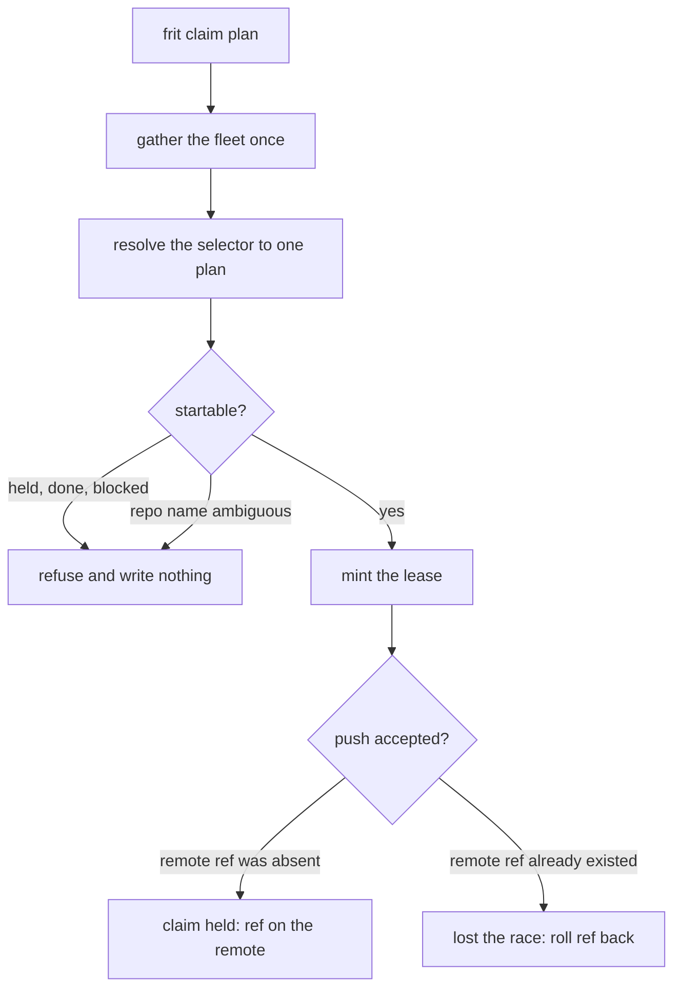
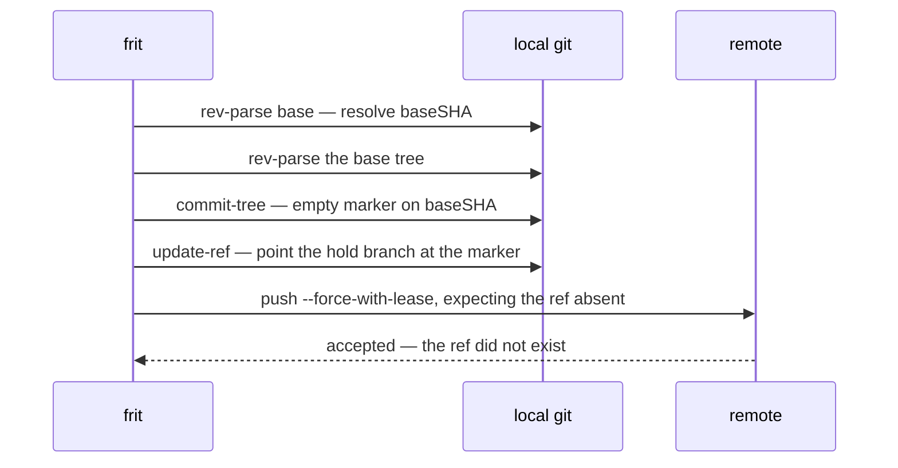
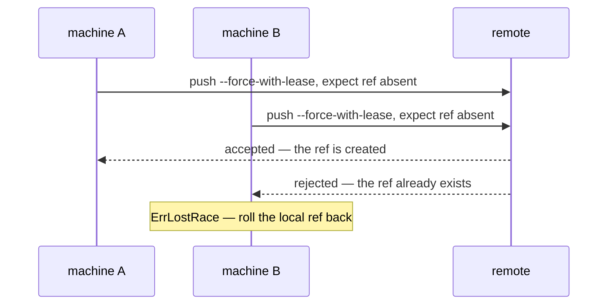

# How claiming works

frit indexes and displays. It owns exactly one mutation: the claim. A
claim is how frit says "this plan is mine to work now." It holds across
every machine that shares the same git remote. This document is how that
one write works.

## A claim is a git ref

A hold on a plan is a branch, `plan/<id>-<slug>`. The slug comes from the
plan file name, after its id prefix. The branch points at an empty marker
commit. That commit carries the same tree as the base it was dated
against, so the claim touches no file. The ref is the whole point; the
commit exists only to carry it.

The branch name is derived, never stored. So the name frit writes is the
name its hold patterns read back: a lease frit mints is a hold frit
finds. Which names count as a hold is declared per repository, in its
`.frit.yml`. Refs already merged into the default branch are excluded, so
landed work never reads as a live claim.

The claim is minted in [internal/claim](../internal/claim). The verbs
that call it are `frit claim` and `frit start`.

## The claim lifecycle

`frit claim <plan>` walks the fleet once. It resolves the selector to a
single plan, and mints a lease only if that plan is startable. A plan
that is held, done, superseded, in progress, or blocked by an unfinished
dependency is refused. Nothing is written.



`frit start` is the same claim, followed by the handoff to herdr: the
worktree, the agent at the plan's tier, and the pane. If any of those
fail to come up, the claim that was already pushed is released. A
half-built lane never lingers as an abandoned hold.

## Minting a lease

Minting is five git commands, run inside the plan's repository. The base
is resolved to a commit and its tree. An empty marker commit is built on
that base. The local hold branch is pointed at the marker. The marker is
then pushed to the remote, under the hold branch's name.



The push is the arbitration. It uses `--force-with-lease=<ref>:` with an
empty expected value. That tells the remote the ref must not already
exist. The remote checks this server-side, and rejects the push if the
ref is there. The check is what makes a hold atomic across machines. Git
offers no other atom, so the claim is built on the one it does.

## Racing two machines

Two machines can resolve the same plan as startable at the same moment.
Each gathered its own view before either pushed. So both build a marker
locally, and both push. The remote applies the lease check to each push
in turn. The first to arrive creates the ref and wins. The second finds
the ref already there, and is rejected.



The loser rolls its local ref back. The claim is all-or-nothing, so a
retry starts from a clean state. A lost race is reported, not crashed on.
It is the one expected non-fatal outcome. frit tells it apart from a real
git fault — an unreachable remote, a rejecting hook — by the remote's
rejection signature. Only a ref that already exists reads as a lost race.
Anything else is a fault, and is surfaced as one.

## When a claim is refused

A refusal is not a failure. It is the honest answer that the plan was not
this run's to take. The command still exits clean.

| Reason                    | What it means                            |
| ------------------------- | ---------------------------------------- |
| already held              | a lane already claims the plan           |
| already done / superseded | the plan's work is finished or replaced  |
| already in progress       | the plan is being worked                 |
| blocked by a dependency   | an unfinished dependency comes first     |
| lost the race             | another machine won the push             |
| repository name ambiguous | two checkouts share the plan's repo name |

The last row is a fail-closed guard. The fleet keys every plan by its
repository's basename. So two checkouts under the root sharing one
basename cannot be told apart. Rather than mint a lease into whichever
the walk reached last, the gather withholds the coordinate and the claim
refuses, naming the collision. Renaming one repository resolves it.

## Releasing a claim

`Release` drops a claim: the local ref, and its copy on the remote. It is
the unwind for a claim that was minted but could not be stood up — a
worktree or agent that failed to come up behind it. A half-built lane
should not read as an abandoned hold. Release is best-effort on the local
side. It reports the remote delete, which is the one that matters.

## The marker records the lease

The marker commit's message records what the claim is for. The ref alone
then tells the full story, with no side channel. It carries the lane it
holds, the host that took it, the base it was dated against, and the plan
file it belongs to.

```text
plan 7: claim shader-unit

lane:     /home/you/git/atlas-shader-unit
host:     workshop
base:     4b825dc642cb6eb9a060e54bf8d69288fbee4904
plan:     plan/7_shader-unit.md
```
