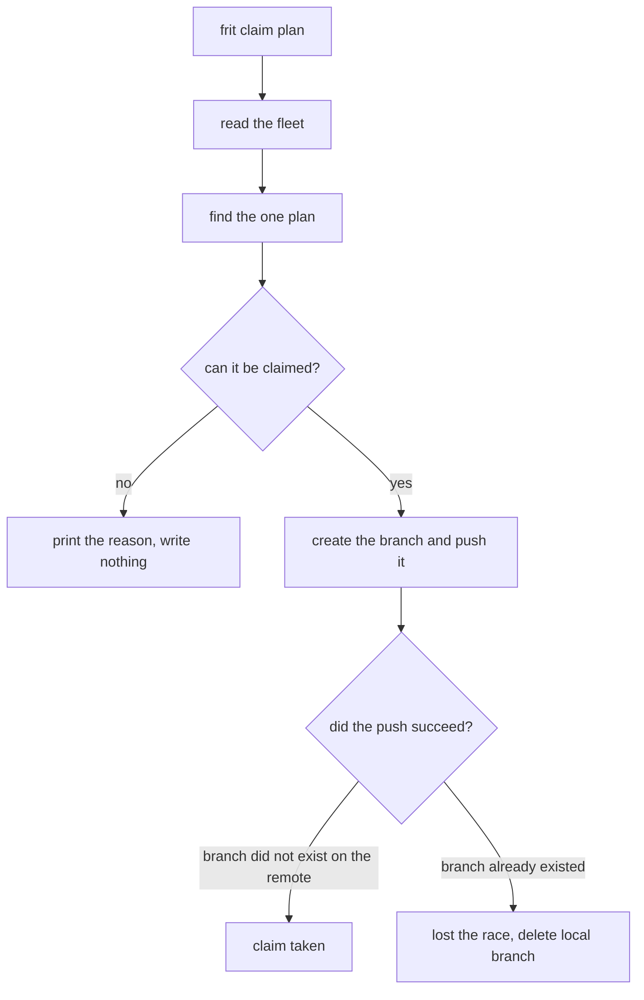
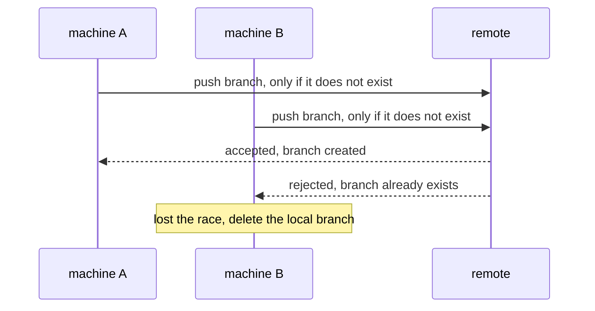

# How claiming works

frit reads many git repositories and shows the plans in them. It changes
only one thing: it claims a plan. A claim marks a plan as being worked,
so every machine that shares the repository's git remote can see the plan
is taken. This page explains how a claim is made, how two machines avoid
taking the same plan, and how to find and drop a claim that is no longer
being worked.

## The fleet

The fleet is every git repository under one directory, the root. You set
the root with `--root` (or `FRIT_ROOT`, or a config file). frit walks the
root, finds each repository under it, and reads all of their plans
together. Every frit command works over the whole fleet.

## A claim is a branch

A git ref is a name that points at a commit. A branch is a ref. frit
claims a plan by creating a branch named `plan/<id>-<name>`, where the id
is the plan's id and the name comes from the plan's file. The branch
points at an empty commit — the marker — that changes no files. The
branch carries no work yet; its job is to exist, so other machines see
the plan is taken.

frit finds claims by listing the branches and keeping the ones whose name
matches a claim pattern. Each repository sets its own patterns in
`.frit.yml`. frit creates branches with the same names it looks for, so a
branch frit makes is a claim frit later finds.

## The branch is where the work goes

`frit start` creates the claim branch, then checks out that same branch
as a worktree (through herdr). An agent commits its work on that branch,
on top of the marker. The claim branch and the work branch are the same
branch.

A plan that is being worked has two parts, both tied to the same branch
name:

- the branch that claims the plan
- the worktree checked out on that branch, where the work is committed

frit reads the plan id out of each branch name — the claim branch and the
worktree's branch — and groups the two parts by that id. The pair is one
lane. If a plan has a claim branch but no worktree, or a worktree but no
claim branch, the two parts disagree, and frit reports it (see [Finding
stale claims](#finding-stale-claims)).

## When a plan can be claimed

frit claims a plan only when all three of these are true:

- it has not been started — its status is 🔲
- no branch already claims it
- every plan it depends on is done — status ✅ — in the same repository

If a plan depends on a plan id frit cannot find, frit counts that
dependency as not done, and will not claim the plan. `frit ready` lists
the plans you can claim now. `frit pick` lists the same plans in order of
how many other plans each one unblocks.

## Making the claim

`frit claim <plan>` reads the fleet, finds the plan, and — if the plan
can be claimed — creates the branch and pushes it to the remote. If the
plan cannot be claimed, frit writes nothing and prints the reason.



frit pushes the branch with `git push --force-with-lease=<branch>:`. The
empty value after the colon means: accept this push only if the branch
does not already exist on the remote. The remote checks this and rejects
the push if the branch is there. That check is what stops two machines
from both taking the same plan.

## Two machines at once

Two machines can decide to claim the same plan at the same time. Each one
read the fleet before either pushed, so each thinks the plan is free.
Both create the branch locally and push.



The remote accepts the first push and creates the branch. The second push
finds the branch already there and is rejected. The machine that lost
deletes its local branch, so it is left as it started, and prints "lost
the race". frit treats only "branch already exists" as a lost race. Any
other push failure — no network, a remote that refuses the connection — is
a real error, and frit reports it as one.

## When a claim is refused

frit refuses a claim it cannot safely make. A refusal is not an error:
the command prints the reason and exits normally.

| Reason                    | What it means                            |
| ------------------------- | ---------------------------------------- |
| already held              | a branch already claims the plan         |
| already done / superseded | the plan's work is finished or replaced  |
| already in progress       | the plan is being worked                 |
| blocked by a dependency   | a plan it depends on is not done         |
| lost the race             | another machine created the branch first |
| repository name ambiguous | two repositories share the plan's name   |

The last row is a safety stop. frit names each plan by its repository's
directory name. If two repositories under the root have the same
directory name, frit cannot tell which one the plan is in, and could push
the branch to the wrong repository. So it pushes to neither and prints
the reason. Rename one repository to fix it.

## A branch that was already merged

Merging a plan's branch into the main branch does not delete the branch.
The branch still exists on the remote. So a second push to that same
branch name would be rejected, the same "lost the race" result, because
the push only checks whether the branch exists — it never looks at
whether the branch was merged. In normal use frit never reaches that
push: a plan whose status is ✅ is refused first.

frit does drop merged branches from what it *reports*. When a plan's
branch has been merged into the main branch, frit stops listing it as a
claim, even though the branch still exists in git. Without this, every
finished plan would still show as claimed, because its branch is still
there. This is a filter on what frit shows; it does not delete anything.

## Finding stale claims

A claim is a branch. If the work stops but the branch stays, the branch
still says the plan is taken. frit does not store which claims are live.
It works that out each time it runs, by listing the branches and the
worktrees and pairing them by plan id.

Two commands report a claim that no longer matches live work:

| Command               | What it reports                                                                                                                                          |
| --------------------- | -------------------------------------------------------------------------------------------------------------------------------------------------------- |
| `frit orphans`        | a claim branch with no worktree behind it: the branch was pushed but the worktree was never created, or the worktree was deleted while the branch stayed |
| `frit stale --days N` | a worktree whose branch has had no new commit in N days                                                                                                  |

`frit who` reports which worktree has an agent running in it right now.
Read it alongside `frit stale`: an idle worktree that still has an agent
is paused, and one with no agent has been left. That is the difference
between a plan someone will come back to and one to clean up.

To drop a stale claim, delete the branch on the remote and locally. The
copy on the remote is the one other machines read, so deleting only the
local branch leaves the plan claimed for everyone else. `frit start` does
this same delete itself when it creates a claim but then fails to set up
the worktree, so a failed start does not leave a claim behind.

## What the marker records

The marker commit's message records what the claim is for, so the branch
alone tells the whole story. It holds the worktree path, the machine that
took the plan, the base commit the branch started from, and the plan
file.

```text
plan 7: claim atlas-shader-unit

lane:     /home/you/git/atlas-shader-unit
host:     workshop
base:     4b825dc642cb6eb9a060e54bf8d69288fbee4904
plan:     plan/7_shader-unit.md
```
